Process flow diagram / documentation for the importing of web shop orders into NAV as part of the [[cii-pbi55179-midyear-membership]] project.

This would map out the end-to-end flow of how orders originate in the Web Shop, get transmitted to NAV, and are processed — including where the midyear membership change logic sits and where the "No Payment" control would intercept. Useful for the solution document and for clarifying the existing code paths.

```mermaid
flowchart TD
    A([OnRun - MageDataInboundMgt]) --> B[ReadMageCust]
    B --> C[Commit]
    C --> D[ReadAndProcessSalesDoc]

    D --> E["Query ACO_MAGESalesHeader\nProcessed NAV = false\nPayment Status ≠ 'canceled'\nError Message = blank"]
    E --> F{Records found?}
    F -- No --> Z([End])
    F -- Yes --> G["For each MageSalesHeader\n→ ACO_MageInbDataMgmt_SalesDoc.Run()"]

    G --> H{Run succeeded?}
    H -- No --> I["Store GetLastErrorText\nin Error Message\nCommit"]
    I --> G
    H -- Yes --> G

    subgraph CU50122["ACO_MageInbDataMgmt_SalesDoc (Cod50122)"]
        direction TB
        R1[Load CiiSetup, GLSetup, AddlSetup] --> R2{Archived Order?}
        R2 -- Yes --> RX([Exit])
        R2 -- No --> R3[CheckCustExists\nby Customer Pin then Customer Id]
        R3 --> R4[CheckWebShopPaymentStatus\nlookup ACO_MagePaymentStatus]
        R4 --> R5[ProcessWebShopSalesDocument]

        R5 --> R6{Customer exists?}
        R6 -- No --> R7["Error In Processing = true\nWrite error message"]
        R6 -- Yes --> R8{Payment complete?\nSuccess / Refund Success\nCLS Pending / CLS Processed}
        R8 -- No --> RX2([Skip - no action])
        R8 -- Yes --> R9{PostPaymentJnl\n= Before?}
        R9 -- Yes --> R10[CreateAndPostOrderPmtJnl]
        R9 -- No --> R11
        R10 --> R11{Channel Type?}

        R11 -- Web --> R12[InsertSalesHeader]
        R11 -- Customer Service --> R13[ProcessCSOrder\nIntegration Event P2]
        R11 -- Corporate --> R14[ProcessCSOrderP3Extension\nIntegration Event P3]

        R12 --> R15["Mark Processed NAV = true\nClear error\nUpdate Processed DateTime"]
        R13 --> R15
        R14 --> R15
    end

    subgraph InsertSalesHeader["InsertSalesHeader → processToSalesOrder"]
        direction TB
        S1{Order exists?} -- No --> S2[Init + Insert Sales Header]
        S1 -- Yes, Released --> S3[Reopen Sales Header]
        S2 --> S4
        S3 --> S4

        S4{IsCLSOrderAndPayment\nStatusProcessed?}
        S4 -- No --> S5[processToSalesOrder]
        S4 -- Yes, CLS --> S5b[processToSalesOrder\n+ P2/P3 Update + P3 Process]

        S5 --> S6[Validate Customer, Dates, Currency]
        S6 --> S7[UpdateSalesHeaderWithP2Extension\nIntegration Event]
        S7 --> S8{Ship address\nvalid?}
        S8 -- Yes --> S9[Map all shipping fields]
        S8 -- No --> S10
        S9 --> S10[Set VAT Bus. Posting Group\nif sell-to ≠ ship-to country]
        S10 --> S11{Zero value order?}
        S11 -- Yes --> S12[Override to Def. Zero Payment Method]
        S11 -- No --> S13
        S12 --> S13{Transfer / Cheque\npayment?}
        S13 -- Yes --> S14["Prepayment % = 100\nFulfilmentStatus = Hold"]
        S13 -- No --> S15
        S14 --> S15[Set Salesperson, Magento flags, RPL flag]
        S15 --> S16{Membership Renewal?}
        S16 -- Yes --> S17[CIIEventMgmt.\nUpdateSalesHeader_MembershipRenewal]
        S16 -- No --> S18
        S17 --> S18[SalesHeader.Modify]
        S18 --> S19[ProcessSalesLine]

        S19 --> S20["For each ACO_MAGESalesLine\n→ InsertSalesLine"]
        S20 --> S21{Freight Charge ≠ 0?}
        S21 -- Yes --> S22[CreateFreightCharge\nAdd freight line]
        S21 -- No --> S23
        S22 --> S23[AddMembershipChargesToOrder\nInstitute / Chartered fees]

        S18b[SalesHeader.Modify] --> S19

        S5 --> S5c{CLS Order?}
        S5c -- Yes --> S24[UpdateSalesHeaderWithP3Extension\nProcessSalesHeaderWithP3Extension]
        S24 --> S25{SalesProcessed?}
        S25 -- No --> SX([Exit])
        S5c -- No --> S26{Transfer / Cheque?}
        S26 -- Yes --> S27[ACO_TryPostPrepayment.Run\nPost prepayment invoice]
        S26 -- No --> S28[ReleaseSalesDoc.Run]
        S27 -- Fail --> S29[Delete SalesHeader\nCommit\nError]
        S28 -- Fail --> S29
    end

    subgraph InsertSalesLine["InsertSalesLine (per line)"]
        direction TB
        L1[Init + Insert bare line] --> L2[Validate Type, No., Variant]
        L2 --> L3[Set Qty, Location from Item.FulfilmentCode]
        L3 --> L4{Membership item?}
        L4 -- Yes --> L5[Price from ACO_MembershipCharge]
        L4 -- No --> L6[Price from Original Price]
        L5 --> L7
        L6 --> L7{Web channel?}
        L7 -- Yes --> L8[Apply Discount % / Amount from Mage line]
        L7 -- No --> L9
        L8 --> L9[UpdateSalesLineWithP2Extension\nUpdateSalesLineWithP4Extension\nIntegration Events]
        L9 --> L10[Set Asendia / Metro / RevisionMate codes]
        L10 --> L11{Transfer payment?}
        L11 -- Yes --> L12[FulfilmentStatus = Hold]
        L11 -- No --> L13
        L12 --> L13{Assembly BOM?}
        L13 -- Yes --> L14["ExplodeAndValidateSalesLine\n→ ExplodeSalesLineBOMComp\n→ CalcTotalCompUnitPrice\n→ CalcPriceDisc\n→ ApplyDiscOrUpdateUnitPrice\n→ AddDiffToLastSalesLineComp"]
        L13 -- No --> L15[Qty to Ship = 0]
        L14 --> L16
        L15 --> L16[Set Resit data, Voucher Code]
        L16 --> L17[SalesLine.Modify]
    end

    G --> CU50122
    R12 --> InsertSalesHeader
    S20 --> InsertSalesLine
```

